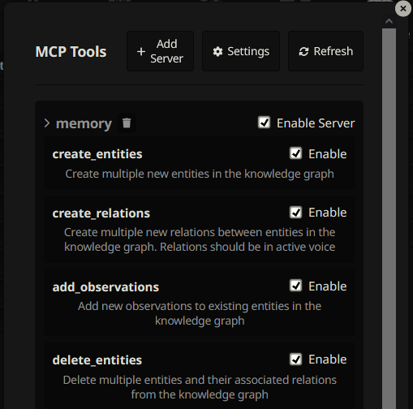

A server plugin of [MCP](https://modelcontextprotocol.io/introduction) for [SillyTavern](https://docs.sillytavern.app/).

> Make sure you only installing trusted MCP servers.



## Installation

1. Go to [server plugin](https://github.com/bmen25124/SillyTavern-MCP-Server) and install.
2. Install via the SillyTavern extension installer:

```txt
https://github.com/bmen25124/SillyTavern-MCP-Client
```

## FAQ

### Where can I find more servers?
[Check out the server list](https://github.com/punkpeye/awesome-mcp-servers).

### I need to change the server configuration, how can I do that?
Press `Settings` button to open location of `mcp_settings.json` with your File Explorer. Edit the file. Disconnect and reconnect via `Enable Server` tickbox.

### I'm getting error when I try to connect to the MCP server.
Check out SillyTavern console for more information. Possible errors:
- Read twice readme of MCP server.
- Missing arguments.
- Invalid `env` param. You might need set API key if it's required.
